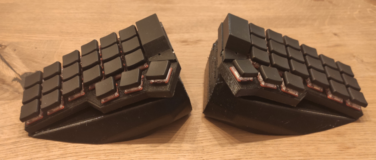
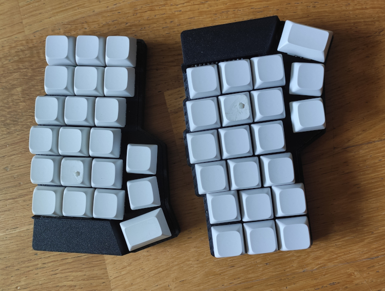

# Corney - Corney Chocoflan and Classical Corne keyboard





- body remixed from this: https://www.printables.com/model/1020389-wireless-corne-chocoflan-minimal-keyboard-case


## Related Projects

- Dacty: https://github.com/maxistar/dacty

## Layout Helper

Use Keyboard Layout Helper to inspect and tune layers visually:
https://projects.maxistar.me/keyboard_helper/

## What's here

- `config/`: ZMK config for a split Corne on nice!nano (keymap, macros, Bluetooth bindings, west manifest).
- `body/`: printable/parametric case and plate models for the Chocoflan remix (scad, stl, step, 3mf).
- `build.yaml`: build matrix for CI (left/right halves on nice_nano@2.0.0).
- `zephyr/module.yml`: declares the repo as a ZMK module, including the Corney shield root and
  the custom GATT features.
- `docs/gatt-layer-exposition.md`: UUIDs, data format, and build notes for the BLE layer
  characteristic.
- `docs/keyboard-helper-ble-v1.md`: implementation, security, queue, and build notes for the
  versioned Keyboard Helper event extension.

## Clone

```bash
git clone https://github.com/maxistar/corney.git
cd corney
```

## Prerequisites

- Zephyr SDK and `west` already installed ([ZMK setup guide](https://zmk.dev/docs/development/setup))

## Build firmware (locally)

1. From the repo root, pull ZMK: `west init -l config && west update`.
3. Build each half (outputs land in `build/<side>/zephyr/zmk.uf2`):
   - Left (enhanced): `west build -p -s zmk/app -d build/left -b nice_nano@2.0.0 -- -DSHIELD=corney_left -DZMK_CONFIG=$PWD/config -DZMK_EXTRA_MODULES=$PWD -DCONFIG_ZMK_KEYBOARD_HELPER_EXTENSION=y`
   - Right: `west build -p -s zmk/app -d build/right -b nice_nano@2.0.0 -- -DSHIELD=corney_right -DZMK_CONFIG=$PWD/config -DZMK_EXTRA_MODULES=$PWD`
4. Copy the corresponding UF2 to each nice!nano over USB bootloader.

## Build firmware with a custom Bluetooth name

The default Bluetooth device name is `Corney`. To override it, pass
`CONFIG_ZMK_KEYBOARD_NAME` when building the left half.

Local build examples:

- Left (enhanced): `west build -p -s zmk/app -d build/left -b nice_nano@2.0.0 -- -DSHIELD=corney_left -DZMK_CONFIG=$PWD/config -DZMK_EXTRA_MODULES=$PWD -DCONFIG_ZMK_KEYBOARD_HELPER_EXTENSION=y -DCONFIG_ZMK_KEYBOARD_NAME=\"CorneyMX\"`
- Right: `west build -p -s zmk/app -d build/right -b nice_nano@2.0.0 -- -DSHIELD=corney_right -DZMK_CONFIG=$PWD/config -DZMK_EXTRA_MODULES=$PWD`

Do not apply the custom name override to the right half. The left half is the central, host-paired side, and the right half should be built with its default configuration.
Omit `CONFIG_ZMK_KEYBOARD_HELPER_EXTENSION=y` only when intentionally building the legacy central
image without the Keyboard Helper service.

## CI/CD

GitHub Actions is the primary CI/CD pipeline. It runs portable protocol/metadata tests, native ZMK
integration tests, and builds enhanced, legacy-only, minimal extension, peripheral, and
settings-reset firmware artifacts. A manual workflow run can override the Bluetooth name for the
left/central image only.

The GitLab CI configuration is retained as an equivalent alternative for a future GitLab mirror.
Local Bluetooth name overrides remain a CMake option so the right/peripheral image cannot
accidentally receive a host-facing name.
