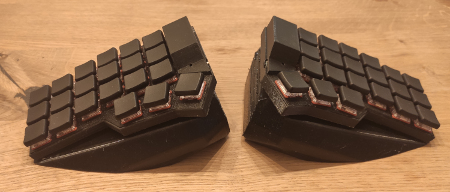
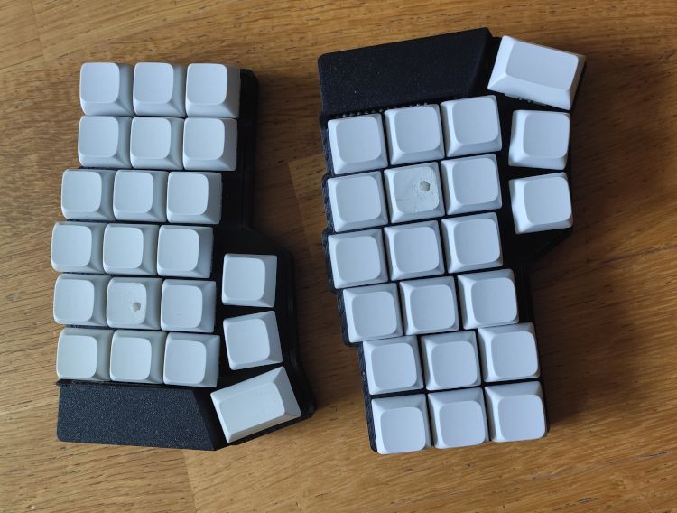

# Corney - Corney Chocoflan and Classical Corne keyboard





- body remixed from this: https://www.printables.com/model/1020389-wireless-corne-chocoflan-minimal-keyboard-case


## Related Projects

- Dacty: https://github.com/maxistar/dacty

## Layout Helper

Use Keyboard Layout Helper to inspect and tune layers visually:
https://projects.maxistar.me/keyboard_helper/

## What's here

- `config/`: ZMK config for a split Corne on nice!nano (keymap, macros, Bluetooth bindings, west manifest).
- `body/`: printable/parametric case and plate models for the Chocoflan remix (scad, stl, step, 3mf).
- `build.yaml`: build matrix for CI (left/right halves on `nice_nano_v2`).
- `zephyr/module.yml`: declares the repo as a ZMK module, including the Corney shield root and
  the custom GATT features.
- `docs/gatt-layer-exposition.md`: UUIDs, data format, and build notes for the BLE layer
  characteristic.
- `docs/keyboard-helper-ble-v1.md`: implementation, security, queue, and build notes for the
  versioned Keyboard Helper event extension.

## Clone

```bash
git clone https://github.com/maxistar/corney.git
cd corney
```

## Prerequisites

- Zephyr SDK and `west` already installed ([ZMK setup guide](https://zmk.dev/docs/development/setup))

## Build firmware (locally)

1. From the repo root, pull ZMK: `west init -l config && west update`.
3. Build each half (outputs land in `build/<side>/zephyr/zmk.uf2`):
   - Left (enhanced): `west build -p -s zmk/app -d build/left -b nice_nano_v2 -- -DSHIELD=corney_left -DZMK_CONFIG=$PWD/config -DZMK_EXTRA_MODULES=$PWD -DCONFIG_ZMK_KEYBOARD_HELPER_EXTENSION=y`
   - Left (stock): `west build -p -s zmk/app -d build/left-stock -b nice_nano_v2 -- -DSHIELD=corney_left -DZMK_CONFIG=$PWD/config -DZMK_EXTRA_MODULES=$PWD -DCONFIG_ZMK_GATT_LAYER_EXPOSITION=n`
   - Right: `west build -p -s zmk/app -d build/right -b nice_nano_v2 -- -DSHIELD=corney_right -DZMK_CONFIG=$PWD/config -DZMK_EXTRA_MODULES=$PWD`
4. Copy the corresponding UF2 to each nice!nano over USB bootloader.

Choose `corney-left-enhanced` when using Keyboard Helper companion telemetry. Choose
`corney-left-stock` for ordinary Corney BLE keyboard use without the complete Keyboard Helper
custom GATT service. “Stock” describes the service boundary: the image still uses this repository's
Corney shield and keymap. Standard Battery Service and Device Information Service availability is
determined by the pinned ZMK configuration rather than by the Keyboard Helper extension.

## Build firmware with a custom Bluetooth name

The default Bluetooth device name is `Corney`. To override it, pass
`CONFIG_ZMK_KEYBOARD_NAME` when building the left half.

Local build examples:

- Left (enhanced): `west build -p -s zmk/app -d build/left -b nice_nano_v2 -- -DSHIELD=corney_left -DZMK_CONFIG=$PWD/config -DZMK_EXTRA_MODULES=$PWD -DCONFIG_ZMK_KEYBOARD_HELPER_EXTENSION=y -DCONFIG_ZMK_KEYBOARD_NAME=\"CorneyMX\"`
- Left (stock): `west build -p -s zmk/app -d build/left-stock -b nice_nano_v2 -- -DSHIELD=corney_left -DZMK_CONFIG=$PWD/config -DZMK_EXTRA_MODULES=$PWD -DCONFIG_ZMK_GATT_LAYER_EXPOSITION=n -DCONFIG_ZMK_KEYBOARD_NAME=\"CorneyMX\"`
- Right: `west build -p -s zmk/app -d build/right -b nice_nano_v2 -- -DSHIELD=corney_right -DZMK_CONFIG=$PWD/config -DZMK_EXTRA_MODULES=$PWD`

Do not apply the custom name override to the right half. The left half is the central, host-paired side, and the right half should be built with its default configuration.
Set `CONFIG_ZMK_GATT_LAYER_EXPOSITION=n` for a stock central with no Keyboard Helper service.
Disabling only `CONFIG_ZMK_KEYBOARD_HELPER_EXTENSION` produces the compatibility-focused legacy
central, which still exposes the custom service and legacy layer characteristic.

## Cirque trackpad

The right/peripheral half supports a Cirque Pinnacle trackpad over the Pro Micro I2C pins. The
wiring uses address `0x2a` and does not connect the trackpad's data-ready (`DR`) signal. There is no
OLED in this configuration. Flash the ordinary `corney-right` image: it is the single supported
right-half artifact both with and without the physical sensor.

Because DR is absent, the Corney module reads the sensor status every 8 ms while the keyboard is
active. The right half forwards relative pointer movement, the sensor's primary tap, and relative
wheel packets over ZMK input-split. The left central consumes the proxy events and sends the normal
USB or BLE HID mouse reports. I2C and the polling driver are enabled only in `corney_right` builds;
Keyboard Helper and all host-facing services remain on `corney_left`.

If the same right image boots without a sensor, initialization fails once and periodic Cirque
polling is not started. Matrix scanning and the BLE split remain independent. The pinned ZMK
baseline does not release input-split buttons automatically on disconnect, so the left firmware
adds a bounded safety release for any active Cirque button when its split connection disappears.

Continuous polling costs additional battery power. During system suspend the polling work stops;
trackpad touch alone cannot wake the right controller without DR. Press a key on the right half or
use another right-side wake source, after which the sensor is reinitialized and pointing resumes
once the split reconnects. A key pressed only on the left is not guaranteed to wake a fully sleeping
right half.

The explicitly named Choc printable entry points are
`body/Choc_Version/right_touchpad_body.scad` and
`body/Choc_Version/right_touchpad_cover.scad`; use
`body/Choc_Version/right_touchpad_assembly.scad` to inspect controller, reset, sensor, and wiring
clearances. Hardware acceptance for this topology is tracked in
`docs/right-peripheral-trackpad-verification.md`.

## CI/CD

GitHub Actions is the primary CI/CD pipeline. It runs portable protocol/metadata tests, native ZMK
integration tests, and builds enhanced, stock, legacy-only, minimal extension, peripheral, and
settings-reset firmware artifacts. The merged `firmware` download contains
`corney-left-stock.uf2` alongside the existing images. A manual workflow run can override the
Bluetooth name for the left/central images only.

The GitLab CI configuration is retained as an equivalent alternative for a future GitLab mirror.
Local Bluetooth name overrides remain a CMake option so the right/peripheral image cannot
accidentally receive a host-facing name.
